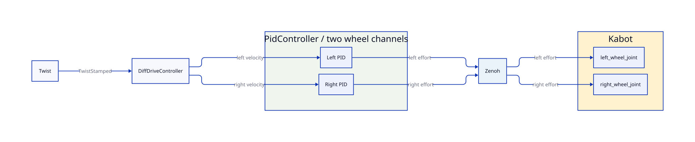

# Control Architecture

Current implemented stack, 2026-10-04. The default native profile is
`calibrated:=true`: physical-unit Twist commands feed an empirical open-loop
motion model. The overview shows that default; the simplified controller
diagram shows the alternative PID profile (`calibrated:=false`).

## End-To-End Architecture

[Editable D2](diagrams/control-architecture.d2) |
[Full-size SVG](diagrams/control-architecture.svg)



Green arrows carry commands; blue arrows carry telemetry or model state.
Dashed amber arrows represent the separate claim/enable path. Dashed gray
arrows show the alternative legacy UDP command ingress.

The host router carries both ROS graph traffic (`rmw_zenoh_cpp`) and raw
Zenbedded traffic. Only the raw bridge transport is drawn. ROS endpoints and
the hardware plugin endpoint must both reach the same router. The current
example endpoint is `tcp/192.168.0.105:7447`; robot addresses are DHCP-dependent.
The existing legacy UDP State egress and non-motor sensor pipelines are outside
this diagram's scope; see [firmware data flow](firmware-data-flow.md).

## Simple PID Command Path

[Editable D2](diagrams/controller-stack.d2) |
[Full-size SVG](diagrams/controller-stack.svg)



This is the requested simplified command path: Twist -> diff-drive -> left
and right PID channels -> Zenoh -> Kabot joints. One ROS `PidController`
instance (`kabot_wheel_pid`) provides both wheel channels, not two separate
controller nodes. `twist_stamper` converts Twist to the TwistStamped input;
the stamper node, hardware bridge, firmware internals and feedback paths are
omitted for clarity.

This path exists in `calibrated:=false`, with P=I=D=0 and feedforward=1, so
feedback correction is disabled. The default `calibrated:=true` instead uses
`kabot_motion_model` in place of the two PID channels. The diagram does not
change controller configuration or re-enable PID feedback.

## Safety And Interpretation

- The motor loop is physically open-loop. `diff_drive.open_loop=false` selects
  **model states** for odometry; it does not enable encoder feedback or PID.
- The model and RViz can advance while the robot is unclaimed, stalled or
  disconnected. Raw encoder telemetry remains diagnostic; one encoder is
  suspected faulty, and missing samples retain previous state.
- A 300 ms diff-drive command timeout zeros references. Separately, the firmware
  subscriber zeros motors when unclaimed or after its 300 ms command watchdog.
  Cached commands alone do not count as new RCL command arrivals.
- Trial scripts check an advancing heartbeat, controller output freshness and
  competing ROS publishers. A 0.6 s freshness failure aborts through zero/release
  cleanup. These checks are script behavior, not a permanent host safety node.
- Bonjour claim/release uses UDP 30012. Claim is neither authentication nor an
  exclusive ownership lock. Legacy UDP motor commands use port 30010; there is
  no arbiter between that ingress and ROS. Do not drive both concurrently.
- Raw Zenbedded keys are shared, not robot-namespaced. Run one robot and one
  controlling stack on these keys. Timeouts and claim are not a certified
  emergency stop.

`calibrated:=false` replaces the model with the historical FF-only PID profile.
It is used by `pixi run calibrate`; raw speeds and trims must not be reused as
calibrated physical commands. `drive-loop` requires the calibrated profile.
See [calibrated motion](calibrated-motion.md) for operating commands and fit
limitations.

## Source Of Truth

- [Native launch](../kabot_ros2/kabot_robot/bringup/launch/native_sim.launch.py)
  and [calibrated profile](../kabot_ros2/kabot_robot/bringup/config/kabot_calibrated_controllers.yaml).
- [Motion controller](../kabot_ros2/kabot_robot/src/calibrated_motion_controller.cpp)
  and [empirical model](../kabot_ros2/kabot_robot/include/kabot_robot/motion_calibration.hpp).
- [Raw profile](../kabot_ros2/kabot_robot/bringup/config/kabot_native_sim_controllers.yaml)
  and [passive view launch](../kabot_ros2/kabot_robot/description/launch/view_robot.launch.py).
- [Wire schema](../app/config/zenbedded_native_sim.yaml)
  and [firmware RCL adapter](../app/src/system/zenbedded_native_sim.cpp).
- [Control validator](../app/src/zbus/channels/control_channel.c)
  and [effort subscriber / watchdog](../app/src/zbus/control/effort_subscriber.c).

## Regenerate

From the repository root, with [D2](https://d2lang.com) installed:

```bash
d2 validate docs/diagrams/control-architecture.d2
d2 validate docs/diagrams/controller-stack.d2
d2 --layout=elk docs/diagrams/control-architecture.d2 docs/diagrams/control-architecture.svg
d2 --layout=elk docs/diagrams/controller-stack.d2 docs/diagrams/controller-stack.svg
```

SVGs were generated with D2 0.7.1 and the ELK layout engine. Edit the D2 sources
and regenerate the SVGs together; rendering requires no running ROS stack or
physical robot.