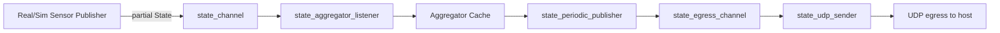

# Real Sensor State Publisher Tutorial

This tutorial explains how to implement a real sensor State fragment publisher in firmware, how the data moves through the robot, and how to extend State with a new field end-to-end (including host updates in kabot_io).

The examples use the current distance implementation (VL53L0X) as a reference.

## 1. Data Transport Concepts: Ingress and Egress

The robot firmware has two directional data paths:

1. Ingress (commands into firmware)
2. Egress (state out of firmware)

### Ingress

Ingress is the control path:

1. UDP packet arrives on control port.
2. Payload is decoded as Control protobuf.
3. Control is validated and published to control_channel.
4. control_subscriber consumes Control and drives motors.

Key files:

- app/src/motor/motor_service.c
- app/src/zbus/control_channel.c
- app/src/zbus/control_subscriber.c

### Egress

Egress is the telemetry/state path:

1. Sensor/producer threads publish partial State fragments to state_channel.
2. state_aggregator_listener merges each partial update into cached aggregate State.
3. state_periodic_publisher copies a full snapshot from the aggregate cache.
4. Snapshot is published to state_egress_channel.
5. state_udp_sender encodes and transmits UDP State packets.

Key files:

- app/src/zbus/state_channel.c
- app/src/zbus/state_aggregator.c
- app/src/zbus/state_periodic_publisher.c
- app/src/zbus/state_egress_channel.c
- app/src/zbus/state_udp_sender.c



## 2. Publishers, Listeners, Subscribers

### Publisher

A publisher produces messages to a zbus channel. In this architecture, sensor publishers produce partial State fragments.

Examples:

- app/src/zbus/sim_imu_publisher.c
- app/src/zbus/sim_magnetometer_publisher.c
- app/src/zbus/sim_distance_publisher.c
- app/src/zbus/distance_publisher.c
- app/src/zbus/effort_state_publisher.c

### Listener

A listener is notified synchronously when a channel publish occurs. Here, state_aggregator_listener receives each partial State publish and merges it into cache immediately.

Why listener-based aggregation is used:

- Synchronous merge at publish time reduces risk that seldom sensor publications could've been lost before aggregation catches up.
- It centralizes the latest-known machine state in one cache.
- Producers remain independent and can run at different rates.

### Subscriber

A subscriber consumes channel data to perform some action. For example, control_subscriber applies control to actuators, and the egress path subscriber side forwards state snapshots.

### Why state is copied into egress

The egress path should send complete, stable snapshots, not only the latest fragment from a single producer. That is why state_periodic_publisher copies aggregate cache into a top-level State snapshot and publishes that snapshot for transport.

This decouples egress cadence from individual sensor update rates and avoids sparse telemetry packets that are missing fields.

## 3. State Message Structure (Protobuf)

State is defined in app/protos/state_control_msg.proto.

- It is protobuf-based.
- All state measurements live in one top-level State structure.
- State is the robot "machine mirror".

Practical meaning of machine mirror:

- Each producer updates only the fields it owns.
- Aggregator merges those fragments into a consistent latest snapshot.
- Host/HMI receives one envelope that reflects the current machine status across subsystems.

Timestamp and merge policy:

- Each field update should include header.stamp.
- Aggregation is field-wise and timestamp-based (newer or equal replaces older).
- This allows mixed-rate producers without global lock-step timing.

Protobuf snippet (current `State`):

```proto
message State {
  Header header = 1;
  StateVector2 effort = 2;

  StateVector3 linear_acceleration = 3;
  StateVector3 angular_velocity = 4;
  StateVector3 magnetic_field = 5;

  StateScalar distance = 6;
}
```

Aggregation snippet (field-wise newer-or-equal replace):

```c
if (incoming->has_distance
  && should_replace_field(incoming->distance.has_header,
              incoming->distance.header.stamp,
              combined->has_distance,
              combined->distance.has_header,
              combined->distance.header.stamp)) {
  combined->has_distance = true;
  combined->distance = incoming->distance;
}
```

## 4. Start from Simulation Publishers, then Real Publisher

Simulation publishers are the fastest way to understand expected fragment shape and publish loop pattern.

Start here:

- app/src/zbus/sim_imu_publisher.c
- app/src/zbus/sim_magnetometer_publisher.c
- app/src/zbus/sim_distance_publisher.c

Distance is a good scalar example:

- Sim scalar: app/src/zbus/sim_distance_publisher.c
- Real scalar: app/src/zbus/distance_publisher.c

Simulation snippet (`sim_distance_publisher`):

```c
State state = State_init_zero;
state.has_distance = true;
state.distance.has_header = true;
state.distance.header.stamp = stamp;
set_header_frame_id(&state.distance.header, CONFIG_KABOT_STATE_DISTANCE_FRAME_ID);
state.distance.state = random_rangef(0.05f, 4.0f);

int rc = publish_state_msg(&state, K_MSEC(publish_timeout_ms));
```

Real distance publisher pattern:

1. Resolve and verify sensor device from devicetree.
2. Loop at configured cadence.
3. Read sensor (sensor_sample_fetch + sensor_channel_get).
4. Build partial State with has_distance plus header stamp/frame_id.
5. Publish to state_channel.
6. Sleep and continue.

Real snippet (`distance_publisher`):

```c
rc = sensor_channel_get(tof, SENSOR_CHAN_DISTANCE, &distance_value);
if (rc != 0) {
  LOG_WRN("sensor_channel_get(SENSOR_CHAN_DISTANCE) failed: %d", rc);
  k_sleep(K_MSEC(CONFIG_KABOT_STATE_DISTANCE_PERIOD_MS));
  continue;
}

State state = State_init_zero;
state.has_distance = true;
state.distance.has_header = true;
state.distance.header.stamp = state_now_stamp_ms();
set_header_frame_id(&state.distance.header, CONFIG_KABOT_STATE_DISTANCE_FRAME_ID);
state.distance.state = sensor_value_to_float_meters(&distance_value);

rc = publish_state_msg(&state, K_MSEC(publish_timeout_ms));
```

## 5. Standardized Kconfig Settings for Publishers

Use a consistent Kconfig shape for every publisher:

1. Enable symbol
2. Period symbol (ms)
3. Frame ID symbol

Current examples in app/Kconfig:

- KABOT_ENABLE_DISTANCE_PUBLISHER
- KABOT_STATE_DISTANCE_PERIOD_MS
- KABOT_STATE_DISTANCE_FRAME_ID

Simulation controls support both global and per-sensor granularity:

- Global: KABOT_ENABLE_SIMULATED_STATE_SENSORS
- Per sensor:
  - KABOT_ENABLE_SIMULATED_IMU_PUBLISHER
  - KABOT_ENABLE_SIMULATED_MAG_PUBLISHER
  - KABOT_ENABLE_SIMULATED_DISTANCE_PUBLISHER

This lets you migrate one sensor at a time:

1. Keep global simulation enabled.
2. Disable only one simulated publisher.
3. Enable real counterpart.
4. Repeat for next sensor.

Build wiring pattern in app/CMakeLists.txt:

- Gate each publisher source file by its CONFIG symbol.
- Keep publisher threads independent and small.

Snippet:

```cmake
if(CONFIG_KABOT_ENABLE_SIMULATED_STATE_SENSORS)
  if(CONFIG_KABOT_ENABLE_SIMULATED_DISTANCE_PUBLISHER)
    target_sources(app PRIVATE src/zbus/sim_distance_publisher.c)
  endif()
endif()

if(CONFIG_KABOT_ENABLE_DISTANCE_PUBLISHER)
  target_sources(app PRIVATE src/zbus/distance_publisher.c)
endif()
```

Kconfig snippet:

```kconfig
config KABOT_ENABLE_DISTANCE_PUBLISHER
  bool "Enable real distance publisher"
  depends on SENSOR
  depends on DT_HAS_ST_VL53L0X_ENABLED
  default y

config KABOT_STATE_DISTANCE_PERIOD_MS
  int "Distance publish period (ms)"
  default 17

config KABOT_STATE_DISTANCE_FRAME_ID
  string "Distance frame_id"
  default "tof"
```

## Manual: Implement Another Real-Life Sensor Publisher

Use this checklist when adding a new real sensor fragment publisher.

1. Devicetree

- Add or verify sensor node in board overlay.
- Ensure compatible and bus/pin config are correct.

2. Kconfig

- Add ENABLE symbol for new publisher.
- Add period and frame_id symbols (or reuse existing if appropriate).
- Add board-level defaults in app/boards/<board>.conf.

3. Build wiring

- Include new source in app/CMakeLists.txt behind ENABLE symbol.

4. Publisher implementation

- Create app/src/zbus/<sensor>_publisher.c.
- Read device readiness.
- Fetch sensor sample and convert to protobuf field type.
- Fill State fragment, including has_* flags and header stamp/frame_id.
- Publish with bounded timeout.
- Log errors and continue loop.

5. Aggregation

- If field already exists in State, ensure state_aggregator merge handles that field.
- If new field, extend merge function accordingly (timestamp compare and assignment).

6. Validate

- Build and flash.
- Validate raw sensor shell read if available.
- Confirm state egress contains expected field updates.

## Manual: Add Another Field to State

When adding a new telemetry field to State, update firmware and host together.

### Firmware steps

1. Update protobuf schema

- Edit app/protos/state_control_msg.proto and add field in State.

2. Regenerate/build protobuf outputs

- Build firmware so nanopb outputs refresh.

3. Update producer(s)

- Populate new field in publisher fragment.
- Set has_* and nested header where applicable.

4. Update state aggregation

- Extend app/src/zbus/state_aggregator.c merge logic for new field.
- Apply same timestamp-based replacement rule.

5. Optional config

- Add period/frame Kconfig options if field is produced periodically.

### Host steps (kabot_io, MVC)

kabot_io is based on MVC architecture.

- Model (scripts/kabot_io/model.py): decode protobuf and map new field into StateSnapshot.
- View (scripts/kabot_io/view.py): expose new field widget and optional plot.
- Controller (scripts/kabot_io/controller.py): keep UI refresh logic and optional Hz logic aligned.

Also update field mapping table:

- scripts/kabot_io/state_fields.py

That mapping is the canonical bridge between protobuf paths and UI snapshot fields.

Mapping snippet:

```python
STATE_FIELDS = [
  # ...
  ("distance.header.stamp", "distance_header_stamp", "distance_header_hz"),
  ("distance.header.frame_id", "distance_header_frame_id", ""),
  ("distance.state", "distance_value", ""),
]
```

Model mapping snippet (`scripts/kabot_io/model.py`):

```python
return StateSnapshot(
  # ...
  distance_header_stamp=str(state.distance.header.stamp),
  distance_header_frame_id=state.distance.header.frame_id,
  distance_value=f"{state.distance.state:.3f}",
)
```

## Practical Verification Checklist

1. Build passes for target board.
2. Kconfig symbols in final .config match intended real/sim toggle state.
3. Sensor shell can read physical sensor values.
4. Publisher logs show active loop and no persistent fetch failures.
5. Egress packets contain updated field values at expected cadence.
6. kabot_io displays new/updated fields correctly.

## Recommended Reading Order

1. docs/firmware-data-flow.md
2. app/src/zbus/sim_distance_publisher.c
3. app/src/zbus/distance_publisher.c
4. app/src/zbus/state_aggregator.c
5. docs/hmi-architecture.md
6. scripts/kabot_io/state_fields.py
